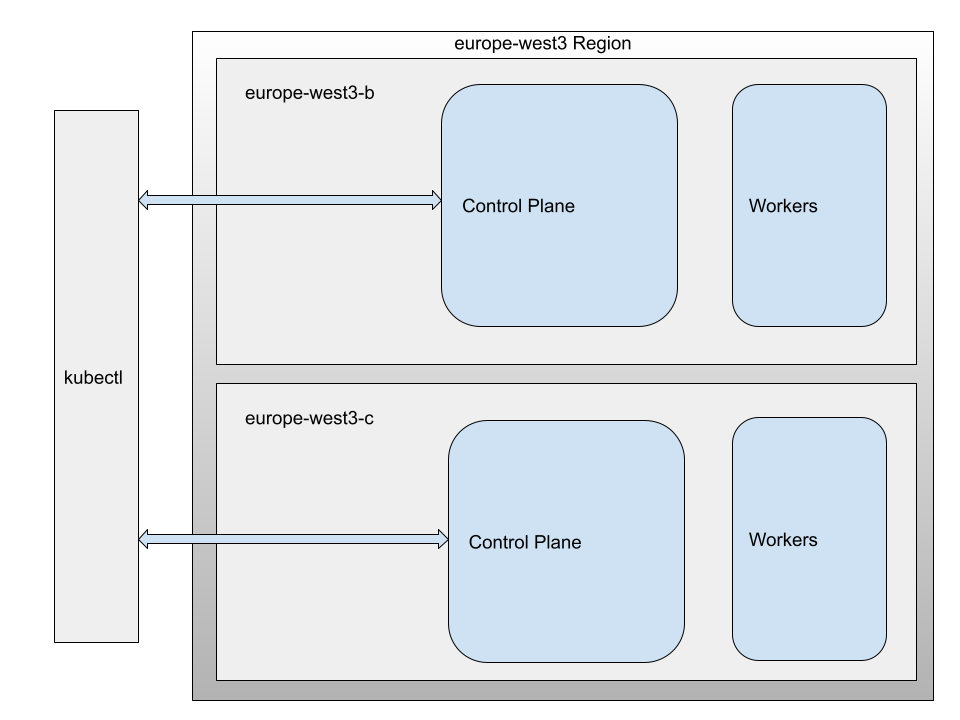

# Simple flask web app example and deployment to Google Cloud

## Rationale

1. A simple "Hello World" application that exposes the following HTTP-based APIs:

* Description: Saves/updates the given user’s name and date of birth in the database.
  * Request: PUT /hello/<username> { “dateOfBirth”: “YYYY-MM-DD” }
  * Response: 204 No Content
  * Note:
    * <username> must contain only letters.
    * YYYY-MM-DD must be a date before the today date.

* Description: Returns hello birthday message for the given user
  * Request: Get /hello/<username>
  * Response: 200 OK
  * Response Examples:
    * A. If username’s birthday is in N days:
        { “message”: “Hello, <username>! Your birthday is in N day(s)” }
    * B. If username’s birthday is today:
        { “message”: “Hello, <username>! Happy birthday!” }

2. For the database I'll use PostgreSQL (Kubernetes cluster GKE). This cluster is highly available
in case one zone goes down and even in case a whole region goes down due to a natural
disaster with a proper automation backup and recovery in failover region.

3. There is diagram of the solution deployed to GCP 

4. Ansible playbook for building and no-downtime production deployment of
this application, keeping in mind aspects that an SRE would have to consider.

5. The tests, are runnable locally with Pytest, and deployable to the cloud using Github actions


## Deploy and test locally Hello app

The app is located in the hello folder. To test it locally there are some requirements to be met:

* Install PostgreSQL and spin up an instance. Be sure that it listens in 0.0.0.0 or ::1

* Create a test database with the credentials you want.

* Initialize the DB by sourcing the ENV vars and executing the initdb.py script: 

```bash
(virtualenv)$ source env.sh
(virtualenv)$ python tests/initdb.py
```

* Create a Python virtualenv (3.8 or 3.9), you can use pyenv.

* Install the requirements:

```bash
(virtualenv)$ pip install -r requirements.txt
```

* Export the needed ENV variables if needed. Have a look at the env file and change them according to your preferences:

```bash
(virtualenv)$ source env.sh
```

* Launch in a new terminal the Flask app:

```bash
(virtualenv)$ python hello/helloapp.py
```

* To test the app simply use curl and change the dateOfBirth and username:

```bash
(virtualenv)$ curl -d '{ "dateOfBirth": "YY-MM-DD" }' -H 'Content-Type: application/json' -X PUT http://localhost:6000/hello/username
(virtualenv)$ curl http://localhost:6000/hello/username
```

* There are a couple of tests designed with Pytest. To use them open a new terminal:

```bash
(virtualenv)$ source env.sh
(virtualenv)$ pytest tests/tests.py
```

Moreover, there is a Github Action to test the hello-app after a push/PR in the repo.

## Build Docker image locally

To generate a docker image and start the container in a local environment:

```bash
(virtualenv)$ sudo docker build -t helloapp .
(virtualenv)$ sudo docker-compose up -d
```
Be sure to change the ENV vars in the ```Dockerfile``` to config the PostgreSQL instance to your needs.


## Deploy Cluster to GC

In the GKE folder there are 3 charts to provision and deploy a postgresql service using a persistent storage volume across two zones and the hello-app. A [GKE regional cluster](https://cloud.google.com/kubernetes-engine/docs/concepts/regional-clusters) offers HA and replicated control planes and nodes in different zones within the region.

<br>


First execute the ansible playbook to generate locally the hello-app container image and push it to the GC registry (You have to configure your credentials properly).
Change the host from the group (ansible/hosts) to localhost or any localnet ip

```bash
$ cd ansible
$ ansible-playbook site.yml --ask-become-pass
```

After this, the hello-app image is pushed into the GC registry

Provision the Regional GKE cluster:

```bash
gcloud container clusters create "hello-gke-regional" \
  --region "eu-west3" \
  --machine-type "e2-standard-2" --disk-type "pd-standard" --disk-size "100" \
  --num-nodes "1" --node-locations "eu-west3-b","eu-west3-c"
```

Create the persistent vol. deployment and postgresql service which is configured as an internal load balancer.

```bash
$ kubectl apply -f postgres-deployment.yml
$ kubectl apply -f postgres-persistentvol.yml
$ kubectl apply -f postgres-service.yml
```

Init the DB schema and change the POSTGRESQL_HOST env var to the internal IP postgresql pod provisioned by the Cluster.

```bash
$ python tests/initdb.py
```

Create the hello-app deployment and service with external IP, load balancer and autoscaling
```bash
$ kubectl apply -f helloapp-deployment.yml
$ kubectl apply -f helloapp-service.yml
```

Test the app using curl again:

```bash
(virtualenv)$ curl -d '{ "dateOfBirth": "YY-MM-DD" }' -H 'Content-Type: application/json' -X PUT http://EXTERNAL_IP/hello/username
(virtualenv)$ curl http://EXTERNAL_IP/hello/username
```


## Backup

The backup script uses GCS to store a pg_dump of a specific database. The dumps are generated in text format and in compressed format (```pg_dump -Fc```).

the backup script can be summoned from a cron job or a Github actions workflow:

```bash
$ backup-pg_dump.sh
```

## WIP improvements

* Use docker secrets to store credentials and also an ansible vault.
* Change the code to use a connection pool with psycopg/sqlalchemy or better, use pgpool or pgbouncer to deploy a connection pooling/balancer service
* Change from standard container registry to Artifacts registry (GKE)
* Improve the PostgreSQL service (HA in different zones) creating another deployment/service for PostgreSQL configured in streaming replication mode with a failover script, to automatically change from hot_standby to master in case anything goes wrong with the master pod.

